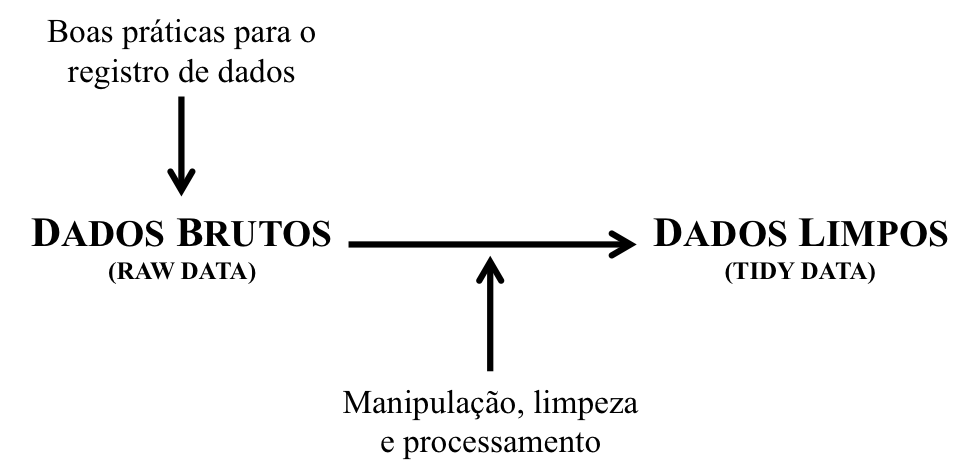
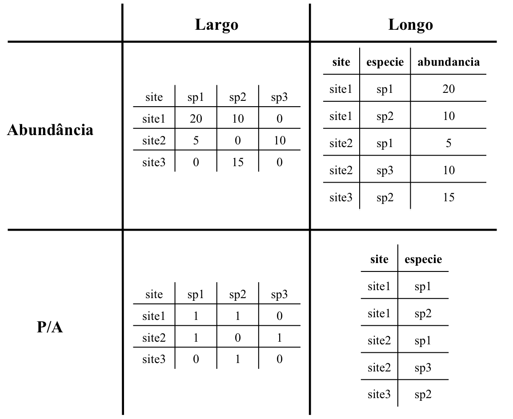

<style type="text/css">
body, td {
   font-size: 18px;
}
code.r{
  font-size: 16px;
}
pre {
  font-size: 16px
}
h1,h2,h3,h4,h5,h6{
  font-size: 24pt;
}
</style>

## Elementos da Aula

1. [A natureza dos dados](#anchor1)
2. [Métodos orientados ao conteúdo das colunas](#anchor#2)
3. [Métodos orientados à tabela de dados](#anchor3)
4. [Dados relacionais](#anchor4)

## A natureza dos dados{#anchor1}

Um dado pode estar em duas diferentes 'fases de maturidade':  
  
1. __Dados brutos (_raw data_):__ são os dados em sua forma mais bruta, recém tabelados, com todos os erros de digitação, de unidade, e etc...  
2. __Dados limpos (_tidy data_):__ são os dados em uma forma limpa. Aqui, os dados brutos foram checados e corrigidos, erros de digitação desfeitos, unidades transformadas e etc. Todo e qualquer nova variável que pode ser gerada com os dados brutos está aqui.  

<p align="center">
</img>
</p>

## A natureza dos dados

Além disso, mesmo os dados limpos podem não estar prontos para o uso ou, ainda, existirem dados derivados que serão o enfoque do seu trabalho.

3. __Dados para análise:__ normalmente você não precisa de todos os dados que você limpou e/ou alguns dos dados úteis para a análise podem estar em outras tabelas. Assim, ao invés de começar toda a análise de dados removendo àquelas informações que não são úteis e buscando àquelas outras que são, você também pode criar recortes de dados que serão específicos para certas tarefas.
4. __Dados dos resultados das análises:__ após rodar uma análise você pode exportar os resultados para fora do R. Ao fazer isso, estes dados retornam para a etapa número 1 - você precisa ajeitar os nomes das colunas, casas decimais,...

## A natureza dos dados

<p align="center">
</img>
</p>

## A natureza dos dados

Outro ponto importante é que algumas análises exigem que os dados sejam apresentados de uma forma específica, o que também leva à duas formas de apresentar um mesmo dado.

<p align="center">
</img>
</p>

## A natureza dos dados {.smaller}

* Uma parte comum e bastante importante em todas essas fases é a manipulação, limpeza e processamento de dados (_tidying data_).  
* É aqui que vamos preparar os dados para o uso em uma análise, para a criação de uma tabela com os resultados que encontramos e, também, para a confecção de figuras.  
* Mas também é onde:
    + Você normalmente faz tudo de forma manual;
    + Você não mantém registro escrito do que está fazendo;
    + Você vai criar múltiplas versões de uma mesma planilha, pois não sabe se as coisas que você está manipulando, mexendo e editando fazem sentido ou estão corretas;
    + Você perde tempo da forma mais repetitiva possível - a não ser que você use uma linguagem de programação! =]  

## Objetivos da manipulação, limpeza e processamento de dados

1. Criar e/ou eliminar novas variáveis (normalmente, nas colunas);  
2. Substituir valores que foram digitados errados;  
3. Substituir palavras e expressões que estejam má digitadas ou onde hajam nomes melhores;  
4. Modificar os nomes das variáveis (normalmente, as colunas);  
5. Modificar os nomes dos níveis das variáveis (normalmente, os valores das linhas de uma determinada coluna);  
6. Separar a informação de uma coluna em duas ou mais;  
7. Rearranjar a ordem das colunas;  
8. Selecionar as colunas que vão compor os dados que serão analisados;  
9. Passar os dados de um formato longo para um formato largo (e vice-versa);  
10. Juntar dados que estão separados em planilhas diferentes;  
11. Remover `NA`s;
12. Selecionar sub-conjuntos dos dados para destinações diferentes (e.g., diferentes pedaços de _tidy data_);
13. Fazer algumas transformações na estrutura original dos dados para criar um _tidy data_ mais condizente com o que você vai precisar na hora das análises.  

## `tidyverse`

* Existem muitas funções na `base` do R que podem ser utilizadas para a manipulação, limpeza e processamento de dados.
* No entanto, muitos dos pacotes mais úteis para estas tarefas estão organizados dentro de um pacote 'guarda-chuva', chamado `tidyverse`.

```{r warning=FALSE, message=FALSE}
library(tidyverse)
tidyverse_packages()
```

## Exercício 1

* Vamos utilizar todas as seis tabelas de dados abaixo nas tarefas e exercícios a seguir.  
a. Importe para o R as seguintes tabelas:
    + __dados dos projetos.csv__, e atribua este arquivo ao objeto __projetos__;
    + __publicacoes.xls__, e atribua este arquivo ao objeto __publicacoes__;
    + __revistas.xlsx__, e atribua este arquivo ao objeto __revistas__.
b. Também, carregue dois conjuntos de dados que estão disponíveis dentro de pacotes:
    + __varechem__ e __varespec__, disponíveis no pacote `vegan`;
    + __gapminder__ disponível no pacote `gapminder`.

```{r message=FALSE, warning=FALSE, echo=FALSE}
library(vegan)
library(gapminder)
library(readxl)
data("varechem")
data("varespec")
projetos <- read_csv(file = "../99 - dados para exemplos/dados dos projetos.csv")
publicacoes <- read_excel(path = "../99 - dados para exemplos/publicacoes.xls", na = "NA")
revistas <- read_excel(path = "../99 - dados para exemplos/revistas.xlsx", na = "NA")
```

## Métodos orientados ao conteúdo das colunas

* É muito comum que cometamos erros de digitação ao preenchermos uma tabela e uma vez que estes erros sejam detectados, normalmente consertamos eles manualmente na tabela de dados brutos.
* No entanto, é bastante preferível que estes consertos sejam realizados através da própria linguagem de programação, a fim de que toda e qualquer alteração e editoração que você tenha feito a um conjunto de dados fique registrado e você não se esqueça no futuro.
* Outra vantagem disso é que qualquer alteração futura que precise ser feita será muito mais fácil, uma vez que apenas será necessário mudar uma única linha de comando - ao invés de repetir manualmente todas as etapas da manipulação, limpeza e processamento de dados.
* Este processo também é útil quando queremos criar novas variáveis baseado nos valores daquelas que já existem.

## Substituição de valores

* Duas funções bastante úteis para modificar valores são `sub` e `gsub`.  

```{r}
sub(pattern = "é", replacement = "e", x = "América do Norte")
sub(pattern = "E", replacement = "e", x = "AmErica do NortE")
gsub(pattern = "E", replacement = "e", x = "AmErica do NortE")
```

## Substituição de valores

* Estas funções também podem ser utilizadas para remover espaços e outros caracteres (como `.`, `,`, `-`, e etc).

```{r}
gsub(pattern = "  ", replacement = " ", x = "Rio  de  Janeiro")
sub(pattern = "/", replacement = " ", x = "PPGE/UFRJ")
sub(pattern = "-", replacement = " ", x = c("Pé-de-moleque", "PPGE-UFRJ"))
```

## Substituição de valores {.smaller}

* Também podemos empregar estas funções em vetores e colunas.
* No exemplo abaixo, utilizamos a função `unique` para termos uma noção de quais são os valores únicos que aparecem dentro da coluna __Chamada__ do objeto __projetos__ - você consegue encontrar algum erro em algum dos elementos?

```{r}
unique(x = projetos$Chamada)
```

## Exercício 2

a. Substitua o erro de digitação que você encontrou pela grafia certa da palavra.  
b. Avalie se esta substiuição corrigiu esta entrada na coluna __Chamada__ do objeto __projetos__.  
c. Caso não tenha sido corrigida, o que você acha que aconteceu? Como podemos realizar essa correção?

```{r echo=FALSE}
projetos$Chamada <- sub(pattern = "Atletica", replacement = "Atlantica", x = projetos$Chamada)
```

## Substituição de valores

* Valores e nomes de variáveis com espaço, muito longos, com caracteres especiais, em caixa alta e etc, podem causar erros durante a indexação e operação de algumas funções. Portanto, é sempre desejável que simplifiquemos estes nomes e tornemos eles consistentes, para evitar possíveis dores de cabeça. Para isso, quatro funções podem ser bastante úteis: `tolower`, `toupper`, `make.names` e `abbreviate`.

```{r}
## vamos criar um vetor com as 10 primeiras publicacoes que aparecem na coluna Publicacao do objeto revistas
exemplo <- revistas$Publicacao[1:10]
exemplo
```

## Substituição de valores

```{r eval=FALSE}
# tolower faz com que todos os caracteres fiquem em caixa baixa
tolower(exemplo)
# toupper faz com que todos os caracteres fiquem em caixa alta
toupper(exemplo)
# make.names faz com que os nomes das colunas mudem para um formato mais amigável a um computador 
make.names(exemplo)
# e, se você achar que os nomes estão muito longos, podemos usar a função abbreviate
abbreviate(exemplo)
```

## Exercício 3

* Observe que os nomes das colunas do objeto __projetos__ não são de todo consistentes. Você conseguiria modificar o nome dessas colunas, fazendo com que todos os caracteres ficassem em caixa baixa? Dica: utilize `names(projetos)` ou `colnames(projetos)` para visualizar o nome das colunas desse `data.frame`.

```{r echo=FALSE}
names(projetos) <- tolower(names(projetos))
```

## Substituição de valores

* Você também pode unir informações presentes em dois ou mais vetores (ou colunas) em um único elemento, utilizando as funções `paste` e `paste0`. Como exemplo, vamos unir a sigla da Unidade da Federação com o nome da Cidade que estão no objeto __projetos__.

```{r eval=FALSE}
## compare as formas abaixo
paste(projetos$cidade, projetos$uf)
paste(projetos$cidade, projetos$uf, sep = "/")
paste0(projetos$cidade, projetos$uf)
paste0(projetos$cidade, "/", projetos$uf)
```

## Exercício 4

* De que forma podemos criar o `data.frame` abaixo? (apenas as primeiras linhas são apresentadas aqui por conta do tamanho)

```{r echo=FALSE}
localidade <- data.frame(id_coordenador = projetos$id_coordenador, localidade = paste0(projetos$cidade, "/", projetos$uf))
localidade[1:12,]
```

## Substituição de valores

* Finalmente, também podemos alterar os valores de uma 

ifelse