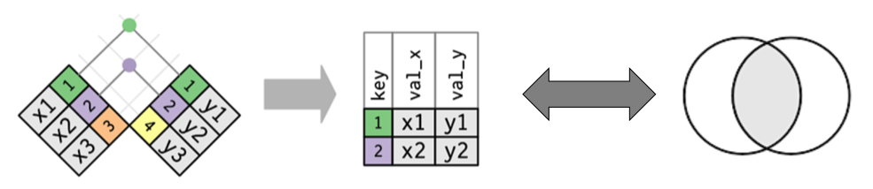
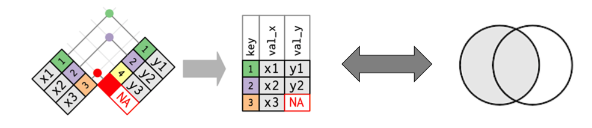
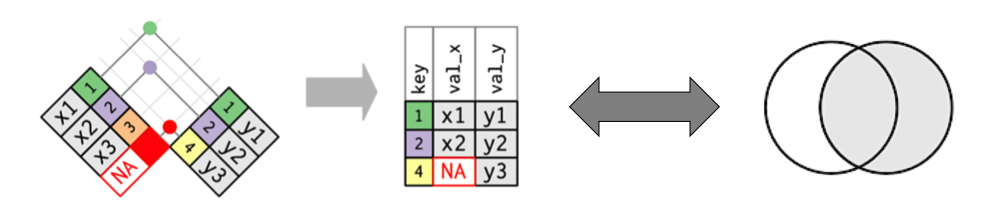
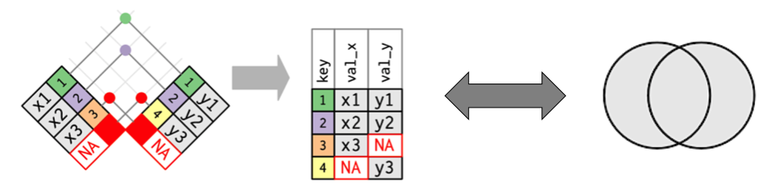
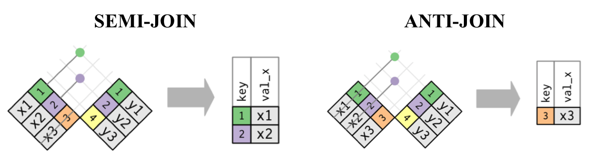

<style type="text/css">
body, td {
   font-size: 18px;
}
code.r{
  font-size: 16px;
}
pre {
  font-size: 16px
}
h1,h2,h3,h4,h5,h6{
  font-size: 24pt;
}
</style>

## Estrutura da Aula

1. [Dados relacionais](#anchor1)
2. [Funções `join` - mutate](#anchor2)
3. [Funções `join` - filter](#anchor3)

## Dados relacionais {.smaller} {#anchor1}

* Quando estamos trabalhando com um conjunto de dados, normalmente pensamos em manter todas as informações juntas em um único arquivo.
* Apesar disso, nem todo dado pode ser incluído da mesma forma em uma tabela:
    * Dados das características das espécies _vs_ dados da abundância das espécies;
    * Dados abióticos _vs_ dados bióticos;
    * Dados das coordenadas amostradas _vs_ dados dos arquivos de mapas;
    * Dados necessários para o cálculo de uma variável composta (e.g., vazão de um rio, emissão de CO~[2]~, dados para o cálculo de alcalinidade da água);
    * ...
* Além disso, é provável que ao tentar manter todos os dados em um único arquivo você acabe se repetindo bastante.

## Dados relacionais {.smaller}

* Uma solução para isso é criar uma estrutura de base de __dados relacionais__.
* De acordo com este tipo de estrutura, os dados são armazenados em diferentes tabelas, que compartilham certos elementos que descrevem a inter-relação entre elas.

<p align="center">
</img>
</p>

## Utilizando a estrutura relacional no R {.smaller}

* Uma vez que tenhamos um conjunto de dados relacionais, podemos utilizar as funções `join` para realização a manipulação e processamento dos dados.
* Existem duas famílias de função `join`:
    + __Mutate join:__ junta duas tabelas em uma nova tabela, mudando ou não o número de linhas e mantendo as colunas das duas tabelas.
        + `inner_join`
        + `left_join`
        + `right_join`
        + `full_join`
    + __Filter join:__ junta duas tabelas, sempre mudando o número de linhas e mantendo as colunas de apenas uma delas.
        + `semi_join`
        + `anti_join`

## Para seguir a demonstração {.smaller}

* Para trabalhar os exemplos a seguir, vamos criar duas tabelas com estrutura relacional (como usamos um `tibble`, precisamos carregar o tidyverse` também).

```{r eval=FALSE}
library(tidyverse)
df1 <-  tibble(id = c(1, 2, 3), x = c("x1", "x2", "x3"))
```

```{r echo=FALSE, warning=FALSE, message=FALSE}
library(tidyverse)
(df1 <-  tibble(id = c(1, 2, 3), x = c("x1", "x2", "x3")))
```

```{r eval=FALSE}
df2 <- tibble(id = c(1, 2, 4), y = c("y1", "y2", "y3"))
```

```{r echo=FALSE}
(df2 <- tibble(id = c(1, 2, 4), y = c("y1", "y2", "y3")))
```

## `inner_join` {#anchor2}

* Retorna uma nova tabela com todas as linhas que `x` e `y` tem em comum, e todas as colunas de `x` e `y`.

<p align="center">
</img>
</p>

## `inner_join`

```{r}
inner_join(x = df1, y = df2, by = "id")
```

## `left_join`

* Retorna uma nova tabela com todas as linhas de `x` e todas as colunas de `x` e `y`. Um __`NA`__ é retornado para os valores das colunas de `y` onde não houver correspondência com as linhas de `x`.

<p align="center">
</img>
</p>

## `left_join`

```{r}
left_join(x = df1, y = df2, by = "id")
```

## `right_join`

* Retorna uma nova tabela com todas as linhas de `y` e todas as colunas de `x` e `y`. Um __`NA`__ é retornado para os valores das colunas de `x` onde não houver correspondência com as linhas de `y`.

<p align="center">
</img>
</p>

## `right_join`

```{r}
right_join(x = df1, y = df2, by = "id")
```

## `full_join`

* Retorna uma nova tabela com todas as linhas e colunas de `x` e `y`. Um __`NA`__ é retornado para os valores das colunas de `y` onde não houver correspondência com as linhas de `x`, e vice-versa.

<p align="center">
</img>
</p>

## `full_join`

```{r}
full_join(x = df1, y = df2, by = "id")
```

## Funções `join` com mais de um elemento relacional

* Nos exemplos anteriores, o argumento `by` sempre recebe um _vetor_ que contém o elemento que descreve a relação entre as duas tabelas que se quer unir (`x` e `y`).
* Assim, podemos passar um vetor com tantos elementos quanto quisermos para descrever a relação entre duas tabelas.

```{r}
df3 <- tibble(id1 = c(1, 1, 1, 1, 2, 2, 2, 2),
              id2 = c("a", "b", "a", "a","a", "b", "b", "b"), 
              x = c("x1", "x2", "x3", "x4", "x5", "x6", "x7", "x8"))
df4 <- tibble(id1 = c(1, 1, 2, 2), 
              id2 = c("a", "b", "a", "b"),
              y1 = c("y1", "y2", "y3", "y4"))
```

## Funções `join` com mais de um elemento relacional

```{r}
inner_join(x = df3, y = df4, by = c("id1", "id2"))
```

## `semi_join` e `anti_join` {#anchor3}

* `semi_join`: retorna uma nova tabela com todas as linhas que `x` e `y` tem em comum, retendo apenas as colunas de `x`.
* `anti_join`: retorna uma nova tabela com as linhas que `x` que __não são compartilhadas__ com `y` , retendo apenas as colunas de `x`.

<p align="center">
</img>
</p>

## `semi_join` e `anti_join` 

* `semi_join`: retorna uma nova tabela com todas as linhas que `x` e `y` tem em comum, retendo apenas as colunas de `x`.

```{r}
semi_join(x = df1, y = df2, by = "id")
```

## `semi_join` e `anti_join` 

* `anti_join`: retorna uma nova tabela com as linhas que `x` que __não são compartilhadas__ com `y` , retendo apenas as colunas de `x`.

```{r}
anti_join(x = df1, y = df2, by = "id")
```

## `Filter join` sem o uso das funções `join` correspondentes {.smaller}

* Uma das formas de determinar a similaridade entre dois vetores é através de um teste lógico.

```{r}
df1$id %in% df2$id
```

* Como o resultado desse teste é um vetor lógico, poderíamos utilizar essa informação para realizar a indexação de uma das tabelas.

```{r}
## resultado similar ao semi_join
df1[df1$id %in% df2$id,]
```

## `Filter join` sem o uso das funções `join` correspondentes

* Por outro lado, podemos usar a função `filter` para obter o mesmo resultado.

```{r warning=FALSE}
filter(.data = df1, id %in% df2$id)
```

## Exercício 1

a. Carregue todos os dados referentes ao financiamento de pesquisa do CNPq (__projetos__, __revistas__ e __publicacoes__);  
b. Determine qual(is) variável(is) descreve(m) a relação entre estas três tabelas de dados;  
c. Calcule o número médio de publicacões e o número médio de citações dos trabalho publicados para cada projeto financiado;  
d. Calcule o índice de impacto médio e máximo (i.e., SJR) das publicacoes de cada projeto;  
e. Adicione estas informações à tabela que descreve as características gerais de cada projeto;  
f. Importe estas informações, utilizando o formato `.csv`.  
