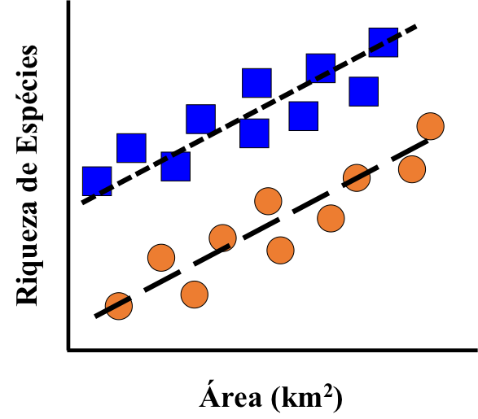

<style type="text/css">
body, td {
   font-size: 18px;
}
code.r{
  font-size: 16px;
}
h1,h2,h3,h4,h5,h6{
  font-size: 24pt;
}
</style>

## Estrutura da Aula

1. [Gramática dos Gráficos](#anchor1)
2. [`ggplot2`](#anchor2)
3. [Exportando figuras do `ggplot2`](#anchor3)
4. [Integrando o `ggplot2` ao `tidyverse`](#anchor4)

## Como você descreveria a figura abaixo? {#anchor1}

<center>
</img>
</center>

## Que figura pode ser feita com estes dados?

```{r echo=FALSE}
data.frame(var1 = rep(c("a", "b"), 3), var2 = rep(c("fechado", "aberto"), each = 3), x = c(2, 3, 2.5, 5, 6, 5.5), y = c(1, 1.5, 1.4, 4.2, 4, 4.6))
```

## Gramática dos Gráficos

* Leland Wilkinson desenvolveu a ideia de que todo gráfico pode ser descrito por um conjunto de componentes semanticos:
    + um sujeito, que são as variáveis que queremos colocar no gráfico (_data_, _aesthetics_);  
    + um ou mais verbos, que representam de que forma o sujeito será apresentado (_geometries_, _facets_);  
    + um ou mais adjetivos, que descrevem características do sujeito (_color_, _fill_, _shape_, _alpha_).  
* Ele organizou isto na forma da Gramática dos Gráficos (_The Grammar of Graphics_) - um esquema para facilitar e descrever a visualização dos dados.  

## Gramática dos Gráficos

### “Resumidamente, a gramática nos diz que um gráfico deve ser mapeado (__mapping__) a partir dos dados (__data__), de acordo com a aparência (__aesthetic__; color, formato, tamanho) de objetos geométricos (__geometric__; pontos, linhas, barras). A figura também pode conter transformações estatísticas dos dados, sendo desenhada a partir de um sistema específico de coordenadas.”  (Do livro "_ggplot2_")

## Gramática dos Gráficos

* Uma figura é desenhada através da sobreposição de diferentes camadas de informações sobre os dados.

<center>
</img>
</center>

## Gramática dos Gráficos

* A ideia principal por traz da Gramática dos Gráficos eé reduzir a distância entre a mente e a página, a ideia e a criação: você desenha, adicionando e modifica as camadas durante o processo de criação da figura. 
* Isto traz algumas vantagens:  
    + Não é preciso desenhar toda a figura de uma vez só (ao contrário das funcionalidades do pacote `lattice`);  
    + Toda camada adicionada à figura pode ser alterada posteriormente (ao contrário das funcionalidades do pacote `base`);  
    + Criação de figuras complexas com comandos simples e intuitivos (ao contrário dos pacotes `lattice` e `base`).  

## `ggplot2` {#anchor2}

* É a implementação da Gramática dos Gráficos na linguagem de programação R.
* É um dos pacotes gráficos mais utilizados, por facilitar muito mais a visualização dos dados quando em comparação com os pacotes `base` e `lattice`. 
* Escrito por Hadley Wickham (cientista chefe do RStudio), quando ainda era um estudante de pós-graduação.
* Podemos carregar este pacote usando o próprio nome `ggplot2` ou através do `tidyverse`.

```{r warning=FALSE, message=FALSE}
library(tidyverse)
```

```{r eval=FALSE}
# outra opção - usar uma ou outra!
library(ggplot2)
```

## Exercício 1

a. Importe para o R a tabela de dados das `ilhas.xlsx`, e atribua esta tabela ao objeto __ilhas__.
b. Carregue o conjunto de dados __gapminder__ disponível no pacote `gapminder`.

```{r message=FALSE, warning=FALSE, echo=FALSE}
library(gapminder)
library(readxl)
ilhas <- read_excel(path = "../99 - dados para exemplos/ilhas.xlsx", na = "NA")
```

## Começando uma figura

* Toda figura criada através do `ggplot2` começa da mesma forma: através da função `ggplot()`.
* Ainda assim, existem duas formas de iniciar uma figura através dessa função, sendo a primeira delas dizendo o que iremos desenhar: __mapearemos__ uma unidade __estética__ que virá de um conjunto de dados.

```{r eval=FALSE}
ggplot(data = ilhas, mapping = aes(x = area, y = riqueza))
```

## Começando uma figura

```{r fig.align='center', fig.height=4.5, fig.width=5}
ggplot(data = ilhas, mapping = aes(x = area, y = riqueza))
```

## Definindo como `x` e `y` são representados

* Uma vez que já definimos que unidade __estética__ será __mapeada__, precisamos definir de que forma esta relação será representada.
* A representação destas relações é feita através de representações __geométricas__, que indicam o tipo de figura que gostaríamos de produzir.
* Como queremos adicionar uma representação __geométrica__ à unidade __estética__ que foi __mapeada__ precisamos, literalmente, adicionar uma camada à outra, utilizando o sinal `+` ao final da linha.

```{r eval=FALSE}
ggplot(data = ilhas, mapping = aes(x = area, y = riqueza)) +
  geom_point()
```

## Definindo como `x` e `y` são representados

```{r fig.align='center', fig.height=4.5, fig.width=5}
ggplot(data = ilhas, mapping = aes(x = area, y = riqueza)) +
  geom_point()
```

## Definindo como `x` e `y` são representados

* Note, no entanto, que o gráfico sugere uma forte relação não-linear - o que é esperado ao plotarmos a área contra a riqueza de espécies em sua escala natural.
* Assim como outros pacotes, o `ggplot2` permite que adicionemos transformações às variáveis que estamos mapeando.

```{r eval=FALSE}
ggplot(data = ilhas, mapping = aes(x = log(area), y = log(riqueza))) +
  geom_point()
```

## Definindo como `x` e `y` são representados

```{r fig.align='center', fig.height=4.5, fig.width=5}
ggplot(data = ilhas, mapping = aes(x = log(area), y = log(riqueza))) +
  geom_point()
```

## Representando a tendência da relação entre `x` e `y`

* Podemos adicionar tantas representações __geométricas__ quanto quisermos à uma figura, desde que faça sentido adicionar uma camada à outra já existente.
* Por exemplo, podemos adicionar uma representação __geométrica__ indicando a tendência da relação entre a área e a riqueza de espécies.

```{r eval=FALSE}
ggplot(data = ilhas, mapping = aes(x = log(area), y = log(riqueza))) +
  geom_point() +
  geom_smooth(method = "lm")
```

## Representando a tendência da relação entre `x` e `y`

```{r fig.align='center', fig.height=4.5, fig.width=5}
ggplot(data = ilhas, mapping = aes(x = log(area), y = log(riqueza))) +
  geom_point() +
  geom_smooth(method = "lm")
```

## Outra forma de desenhar uma figura através do `ggplot2`

* Uma maneira alternativa a criar uma figura no `ggplot2` é começando através de um gráfico em branco, e ir adicionando as informações que queremos mapear camada a camada.
* Todavia, ao utilizar este método será necessário dizer à função quais são os dados e quais são os elementos estéticos que serão mapeados em cada camada.

```{r eval=FALSE}
ggplot()
```

## Outra forma de desenhar uma figura através do `ggplot2`

```{r fig.align='center', fig.height=4.5, fig.width=5}
ggplot()
```

## Outra forma de desenhar uma figura através do `ggplot2`

```{r fig.align='center', fig.height=4.5, fig.width=5}
ggplot() +
  geom_point(data = ilhas, mapping = aes(x = log(area), y = log(riqueza)))
```

## Outra forma de desenhar uma figura através do `ggplot2` {.smaller}

```{r fig.align='center', fig.height=4.5, fig.width=5}
ggplot() +
  geom_point(data = ilhas, mapping = aes(x = log(area), y = log(riqueza))) +
  geom_smooth(data = ilhas, mapping = aes(x = log(area), y = log(riqueza)), method = "lm")
```

## Outra forma de desenhar uma figura através do `ggplot2` {.smaller}

* Finalmente, uma terceira forma de iniciar uma figura é determinando apenas o conjunto de dados de onde sairão todas as informações, e determinar o que será mapeado em cada camada

```{r fig.align='center', fig.height=3, fig.width=3.5}
ggplot(data = ilhas) +
  geom_point(mapping = aes(x = log(area), y = log(riqueza))) +
  geom_smooth(mapping = aes(x = log(area), y = log(riqueza)), method = "lm")
```

## Mapear desde o início ou não?

* Existe uma diferença fundamental na forma como começamos a desenhar um gráfico no `ggplot2`, que podemos usar ao nosso favor dependendo do objetivo e dados que temos:
    + __Especificar apenas o conjunto de dados na função `ggplot`:__ útil quando todas as informações que irão para cada `geom` estão dentro de uma mesma tabela.  
    + __Especificar o conjunto de dados e a unidade estética dentro da função `geom`:__ útil quando cada `geom` representa informações presentes em conjunto de dados diferentes. 
    + __Especficiar o conjunto de dados e a unidade estética dentro da função `ggplot`:__ útil quando toda a figura é feita com referência àquela unidade estética vinda daquele conjunto de dados.
* Dependendo da forma como você escolher desenhar a figura, você pode ter problemas ao definir alguns outros elementos gráficos - falaremos mais sobre isso depois.

## Criando uma figura do `ggplot2` objeto-a-objeto

* Não precisamos criar todas as camadas de uma vez ao desenhar uma figura no `ggplot2`: podemos criar uma camada, atribuir ela a um objeto, adicionar mais uma camada a esse objeto e sobre-escrevelo, e assim sucessivamente.

```{r fig.align='center', fig.height=3, fig.width=3.5}
figura <- ggplot(data = ilhas, mapping = aes(x = log(area), y = log(riqueza)))
figura
```

## Criando uma figura do `ggplot2` objeto-a-objeto

```{r fig.align='center', fig.height=4, fig.width=4.5}
figura <- figura +
    geom_point()
figura
```

## Criando uma figura do `ggplot2` objeto-a-objeto

```{r fig.align='center', fig.height=4, fig.width=4.5}
figura <- figura +
    geom_smooth(method = "lm")
figura
```

## Exercício 2

a. Crie uma figura demonstrando a relação entre a riqueza de espécies de mamíferos e a produtividade primária das ilhas.
b. Crie um `boxplot` demonstrando de que maneira a riqueza de espécies varia em função do tipo de ilha.

## Customizando um `geom`

* Assim como nas figuras criadas na `base` e no `lattice`, também podemos modificar o tamanho (`size`), formato (`shape`), cor da borda (`color`), preenchimento (`fill`), grossura da linha dos símbolos (`stroke`) e das linhas (`size`), tipo de linhas (`linetype`) de cada `geom`.

```{r eval=FALSE}
ggplot(data = ilhas, mapping = aes(x = log(area), y = log(riqueza))) +
  geom_point(size = 4)
```

## Customizando um `geom`

```{r fig.align='center', fig.height=4, fig.width=4.5}
ggplot(data = ilhas, mapping = aes(x = log(area), y = log(riqueza))) +
  geom_point(size = 4)
```

## Customizando um `geom`

```{r fig.align='center', fig.height=4, fig.width=4.5}
ggplot(data = ilhas, mapping = aes(x = log(area), y = log(riqueza))) +
  geom_point(size = 4, shape = 21)
```

## Customizando um `geom`

```{r fig.align='center', fig.height=4, fig.width=4.5}
ggplot(data = ilhas, mapping = aes(x = log(area), y = log(riqueza))) +
  geom_point(size = 4, shape = 21, fill = "grey50")
```

## Customizando um `geom`

```{r fig.align='center', fig.height=4, fig.width=4.5}
ggplot(data = ilhas, mapping = aes(x = log(area), y = log(riqueza))) +
  geom_point(size = 4, shape = 21, fill = "grey50", 
             colour = "blue3")
```

## Customizando um `geom`

```{r fig.align='center', fig.height=4, fig.width=4.5}
ggplot(data = ilhas, mapping = aes(x = log(area), y = log(riqueza))) +
  geom_point(size = 4, shape = 21, fill = "grey50", 
             colour = "blue3", stroke = 2)
```

## Customizando um `geom`

```{r fig.align='center', fig.height=4, fig.width=4.5}
ggplot(data = ilhas, mapping = aes(x = log(area), y = log(riqueza))) +
  geom_point(size = 4, shape = 21, fill = "grey50", 
             colour = "blue3", stroke = 2, alpha = 0.4)
```

## Exercício 3

a. Customize o `boxplot` que você criou no exercício anterior. Para saber que tipo de customização pode ser feita a esse `geom`, você pode consular o arquivo de ajuda dele `?geom_boxplot`.

## Customizando um `geom` através da unidade estética

* Quando fazemos uma análise exploratória dos dados ou até mesmo quando estamos criando uma figura para um trabalho, podemos ter como objetivo demonstrar de que forma múltiplas variáveis afetam a relação entre `x` e `y`.
* Graficamente, quando fazemos isso na realidade estamos mapeando estas outras variáveis a um dado `geom` - isto é, fazemos as características deste `geom` variar em função dos valores destas variáveis.
* Para tal, devemos dizer para o `ggplot` que todas aquelas características que acabamos de ver para a customização dependem dos valores estéticos que queremos mapear.

```{r eval=FALSE}
ggplot(data = ilhas, mapping = aes(x = log(area), y = log(riqueza), colour = ilha)) +
  geom_point()
```

## Customizando um `geom` através da unidade estética

```{r fig.align='center', fig.height=4, fig.width=4.5}
ggplot(data = ilhas, mapping = aes(x = log(area), y = log(riqueza), colour = ilha)) +
  geom_point()
```

## Customizando um `geom` através da unidade estética

```{r fig.align='center', fig.height=4, fig.width=4.5}
# outra forma de fazer isso
ggplot(data = ilhas, mapping = aes(x = log(area), y = log(riqueza))) +
  geom_point(mapping = aes(colour = ilha))
```

## Customizando um `geom` através da unidade estética

```{r fig.align='center', fig.height=4, fig.width=4.5}
# e mais uma
ggplot() +
  geom_point(data = ilhas, mapping = aes(x = log(area), y = log(riqueza), colour = ilha))
```

## Customizando um `geom` através da unidade estética

* É importante notarmos algumas coisas ao fazermos isso:
    + A característica que será mapeada à variável deve estar dentro do `mapping`!
    + O nome da variável que será mapeada a alguma dessas características __nunca__ deve estar entre aspas!
    + Ao definir que variável será mapeada a que característica logo na função `ggplot`, esta característica será mapeada da mesma forma em todas as camadas que você desenhar!
    + Podemos mapear múltiplas variáveis ao mesmo tempo.
    
## Customizando um `geom` através da unidade estética

```{r fig.align='center', fig.height=4, fig.width=4.5}
ggplot(data = ilhas, mapping = aes(x = log(area), y = log(riqueza), colour = ilha,
                                   shape = arquipelago)) +
  geom_point()
```

## Customizando um `geom` através da unidade estética

```{r fig.align='center', fig.height=4, fig.width=4.5}
ggplot(data = ilhas, mapping = aes(x = log(area), y = log(riqueza), colour = ilha,
                                   shape = arquipelago, size = produtividade)) +
  geom_point()
```

## Customizando um `geom` através da unidade estética

* Também podemos combinar características mapeadas à variáveis com características mapeadas de forma fixa.
* Mas não se esqueça: toda característica mapeada a uma variável vai dentro do parenteses, toda característica fixa vai fora dele.

```{r eval=FALSE}
ggplot(data = ilhas, mapping = aes(x = log(area), y = log(riqueza))) +
  geom_point(mapping = aes(colour = ilha, shape = arquipelago), size = 4)
```

## Customizando um `geom` através da unidade estética

```{r fig.align='center', fig.height=4.5, fig.width=5}
ggplot(data = ilhas, mapping = aes(x = log(area), y = log(riqueza))) +
  geom_point(mapping = aes(colour = ilha, shape = arquipelago), size = 4)
```

## Exercício 4

a. Adicione uma linha de tendência ao gráfico abaixo. O que aconteceu e o que isso representa?
b. Se você quisesse que houvesse apenas uma linha de tendência, como deveríamos desenhar a figura?
c. Modifique as características da linha de tendência que você adicionou, mapeando ela à qualquer variável que você deseje.
d. O que acontece quando invertemos a sequência como os `geom` são adicionados?

```{r eval=FALSE}
ggplot(data = ilhas, mapping = aes(x = log(area), y = log(riqueza), colour = ilha)) +
  geom_point(size = 3)
```

## Criando múltiplos painéis a partir dos mesmo dados

* Muitas vezes queremos desenhar uma figura contendo múltiplos painéis, um para cada nível ou combinação de níveis de uma dada variável.
* O `ggplot2` oferece duas funções que permitem mapear estes painéis em múltiplos `facet`s. No entanto, note que aqui o que estamos fazendo é dividir uma mesma informação entre múltiplos painéis, e não desenhar informações diferentes em cada painel!
    + `facet_wrap`: permite que se determine de que forma os painéis serão distribuídos entre linhas e colunas. É uma função bastante flexível.
    + `facet_grid`: não permite que os painéis sejam distribuídos entre linhas e colunas, que são determinados de acordo com a quantidade de níveis de cada variável que se está mapeando aos painéis.

## Criando múltiplos painéis a partir dos mesmo dados

```{r fig.align='center', fig.height=4.5, fig.width=7}
ggplot(data = ilhas, mapping = aes(x = log(area), y = log(riqueza))) +
  facet_wrap(~ ilha) +
  geom_point(size = 3)
```

## Criando múltiplos painéis a partir dos mesmo dados

```{r fig.align='center', fig.height=4.5, fig.width=7}
ggplot(data = ilhas, mapping = aes(x = log(area), y = log(riqueza))) +
  facet_grid(~ ilha) +
  geom_point(size = 3)
```

## Criando múltiplos painéis a partir dos mesmo dados

```{r fig.align='center', fig.height=4.5, fig.width=7}
ggplot(data = ilhas, mapping = aes(x = log(area), y = log(riqueza))) +
  facet_wrap(arquipelago ~ ilha) +
  geom_point(size = 3)
```

## Criando múltiplos painéis a partir dos mesmo dados

```{r fig.align='center', fig.height=4.5, fig.width=7}
ggplot(data = ilhas, mapping = aes(x = log(area), y = log(riqueza))) +
  facet_grid(arquipelago ~ ilha) +
  geom_point(size = 3)
```

## Personalizando o aspecto visual do `geom` {.smaller}

* Muito do que podemos fazer manipulando a estrutura estética do que queremos desenhar só diz o que será mapeado, mas não nos permite determinar exatamente de que forma queremos que cada característica mapeada seja representa.
* Toda a personalização do que é mapeado é feita através de camadas que descrevem a __escala__ da figura:
    + `scale_fill_?`: modifica o preenchimento do objeto (`fill`) de forma determinada pelo usuário;  
    + `scale_colour_?`: modifica a cor dos pontos ou das bordas do objeto geométrico (`colour`) de forma determinada pelo usuário;  
    + `scale_shape_?`: modifica o formato dos pontos (`shape`) de forma determinada pelo usuário;  
    + `scale_size_?`: modifica o tamanho dos pontos (`size`) de forma determinada pelo usuário;  
    + `scale_alpha_?`: modifica a transparência (`alpha`) de forma determinada pelo usuário;  
    + `scale_linetype_?`: modifica o tipo de linha (`linetype`) de forma determinada pelo usuário;  
    + `scale_x_?`: modifica as opções de apresentação do eixo _x_;  
    + `scale_y_?`: modifica as opções de apresentação do eixo _y_.  

## Personalizando o aspecto visual do `geom`

* Para personalizar grande parte destas escalas é necessário que aquilo que ela modifica tenha sido mapeado à alguma unidade estética.

```{r eval=FALSE}
ggplot(data = ilhas, mapping = aes(x = log(area), y = log(riqueza), shape = ilha)) +
  geom_point(size = 4) +
  geom_smooth(method = "lm") +
  scale_shape_manual(values = c(21, 22))
```

## Personalizando o aspecto visual do `geom`

```{r fig.align='center', fig.height=5, fig.width=6, echo=FALSE}
ggplot(data = ilhas, mapping = aes(x = log(area), y = log(riqueza), shape = ilha)) +
  geom_point(size = 4) +
  scale_shape_manual(values = c(21, 22))
```

## Personalizando o aspecto visual do `geom`

```{r eval=FALSE}
ggplot(data = ilhas, mapping = aes(x = log(area), y = log(riqueza), 
                                   shape = ilha, fill = ilha)) +
  geom_point(size = 4) +
  geom_smooth(method = "lm") +
  scale_shape_manual(values = c(21, 22)) +
  scale_fill_manual(values = c("firebrick2", "deepskyblue"))
```

## Personalizando o aspecto visual do `geom`

```{r fig.align='center', fig.height=5, fig.width=6, echo=FALSE}
ggplot(data = ilhas, mapping = aes(x = log(area), y = log(riqueza), 
                                   shape = ilha, fill = ilha)) +
  geom_point(size = 4) +
  geom_smooth(method = "lm") +
  scale_shape_manual(values = c(21, 22)) +
  scale_fill_manual(values = c("firebrick2", "deepskyblue"))
```

## Exercício 5

a. Customize o `boxplot` que apresenta de que forma a riqueza de espécies variam em função do tipo de ilha, mas fazendo um painel para cada tamanho de arquipélago e utilizando as funções `scale`.
    + Dica: o intuito é que esta customizando leve o gráfico a ficar __apresentável__ e adequado para uma publicação, tese, documento ou qualquer coisa similar. Para tanto, é essencial que ela seja visualmente agradável e auto-explicativa!

## Personalizando o aspecto visual do `geom`

* Podemos utilizar as funções `scale_x_?` e `scale_y_?` para realizar diversos tipos de manipulação aos eixos `x` e `y`.

```{r eval=FALSE}
figura <- ggplot(data = ilhas, mapping = aes(x = log(area), y = log(riqueza), 
                                             shape = ilha, fill = ilha, colour = ilha)) +
  geom_point(size = 4) +
  geom_smooth(method = "lm") +
  scale_shape_manual(values = c(21, 22)) +
  scale_fill_manual(values = c("firebrick2", "deepskyblue"))
figura
```

```{r echo=FALSE}
figura <- ggplot(data = ilhas, mapping = aes(x = log(area), y = log(riqueza), 
                                             shape = ilha, fill = ilha, colour = ilha)) +
  geom_point(size = 4) +
  geom_smooth(method = "lm") +
  scale_shape_manual(values = c(21, 22)) +
  scale_fill_manual(values = c("firebrick2", "deepskyblue"))
```

## Personalizando o aspecto visual do `geom`

```{r fig.align='center', fig.height=4, fig.width=5}
## adicionando um título adequado a cada eixo
figura +
  scale_x_continuous(name = "Área (km², log)") +
  scale_y_continuous(name = "Riqueza de Espécies (log)")
```

## Personalizando o aspecto visual do `geom`

```{r fig.align='center', fig.height=4, fig.width=5}
## modificar a sequência de números de um dos eixos
figura +
  scale_x_continuous(name = "Área (km², log)", breaks = seq(from = -3, to = 12, by = 3)) +
  scale_y_continuous(name = "Riqueza de Espécies (log)")
```

## Personalizando o aspecto visual do `geom`

```{r fig.align='center', fig.height=4, fig.width=5}
## modificar o texto dos eixos
figura +
  scale_x_continuous(name = "Área (km²)", breaks = seq(from = -3, to = 12, by = 3),
                     labels = c(-3, "", "3", "", 9, "")) +
  scale_y_continuous(name = "Riqueza de Espécies")
```

## Exercício 6

a. Customize os eixos do `boxplot` que você criou no último exercício.

## Personalizando o aspecto visual do `geom`

* Quando criamos figuras onde os valores de um dos eixos é discreto/categórico, o R vai utilizar como sequência a ordem alfabética (ou numérica) desta variáveil. No entanto, muitas vezes, a ordem alfabética não condiz com a magnitude ou efeito daquilo que queremos demonstrar e, portanto, precisamos modificar este padrão imposto pelo R.
* Existem duas formas principais de fazer isso.

```{r eval=FALSE}
ggplot(data = ilhas, mapping = aes(x = arquipelago, 
                                   y = log(riqueza), fill = arquipelago)) +
  geom_boxplot(outlier.colour = NA, width = 0.5, size = 1)
```

## Personalizando o aspecto visual do `geom`

```{r fig.align='center', fig.height=4, fig.width=4.5}
ggplot(data = ilhas, mapping = aes(x = arquipelago, 
                                   y = log(riqueza), fill = arquipelago)) +
  geom_boxplot(outlier.colour = NA, width = 0.5, size = 1)
```

## Personalizando o aspecto visual do `geom`

```{r fig.align='center', fig.height=4, fig.width=5}
# através da função reorder
ggplot(data = ilhas, mapping = aes(x = reorder(arquipelago, log(riqueza)), 
                                   y = log(riqueza), fill = arquipelago)) +
  geom_boxplot(outlier.colour = NA, width = 0.5, size = 1)
```

## Personalizando o aspecto visual do `geom` e da figura

```{r fig.align='center', fig.height=4, fig.width=5}
# através da função fct_relevel, disponível no pacote forcats
ggplot(data = ilhas, mapping = aes(
  x = forcats::fct_relevel(arquipelago, "pequeno", "medio", "grande"), 
  y = log(riqueza), fill = arquipelago)) +
  geom_boxplot(outlier.colour = NA, width = 0.5, size = 1)
```

## Uma figura-padrão, antes de prosseguirmos

```{r eval=FALSE}
figura <- ggplot(data = ilhas, 
                 mapping = aes(x = log(area), y = log(riqueza), 
                               shape = ilha, fill = ilha, colour = ilha)) +
  geom_point(size = 4) +
  geom_smooth(method = "lm") +
  scale_shape_manual(values = c(21, 22)) +
  scale_fill_manual(values = c("firebrick2", "deepskyblue")) +
  scale_x_continuous(name = "Área (km², log)", breaks = seq(from = -3, to = 12, by = 3)) +
  scale_y_continuous(name = "Riqueza de Espécies (log)")
figura
```

```{r echo=FALSE}
figura <- ggplot(data = ilhas, 
                 mapping = aes(x = log(area), y = log(riqueza), 
                               shape = ilha, fill = ilha, colour = ilha)) +
  geom_point(size = 4) +
  geom_smooth(method = "lm") +
  scale_shape_manual(values = c(21, 22)) +
  scale_fill_manual(values = c("firebrick2", "deepskyblue")) +
  scale_x_continuous(name = "Área (km², log)", breaks = seq(from = -3, to = 12, by = 3)) +
  scale_y_continuous(name = "Riqueza de Espécies (log)")
```

## Personalizando o aspecto visual da figura

* Um importante aspecto negligenciado por grande parte das pessoas que acabam usando o `ggplot2` é esse fundo cinza e grids, que são legais para explorar visualmente os dados, mas são péssimos para uma publicação.
* Esses e outros aspectos visuais gerais de um gráfico do `ggplot2` são o __tema__ dele, sendo controlados por uma função de mesmo nome - `theme`.
* __Sempre modifique e edite o tema que você usa ao criar uma figura do ggplot!__

## Personalizando o aspecto visual da figura

* Existem muitos temas pré-definidos disponíveis no `ggplot2` quando você carrega o pacote.

```{r fig.align='center', fig.height=4, fig.width=5}
figura +
  theme_bw()
```

## Personalizando o aspecto visual da figura

```{r fig.align='center', fig.height=4, fig.width=5}
figura +
  theme_classic()
```

## Personalizando o aspecto visual da figura

```{r fig.align='center', fig.height=4, fig.width=5}
figura +
  theme_minimal()
```

## Personalizando o aspecto visual da figura

* E existem outros temas pré-definidos disponíveis em outros pacotes, como no `ggthemes`.

```{r fig.align='center', fig.height=4, fig.width=5, warning=FALSE, message=FALSE}
library(ggthemes)
figura +
  theme_base()
```

## Personalizando o aspecto visual da figura

```{r fig.align='center', fig.height=4, fig.width=5, warning=FALSE, message=FALSE}
figura +
  theme_excel_new()
```

## Personalizando o aspecto visual da figura

* Mas como tudo no `ggplot2`, o ideal é sempre personalizarmos aquilo que estamos desenhando. Para modificar o __tema__ desta forma, precisamos modificar os padrões de valores que existe dentro da função `theme`, adicionando esta camada de personalização à nossa figura.

```{r eval=FALSE}
theme()
```

## Personalizando o aspecto visual da figura

* Todos os elementos do __tema__ são manipulados de acordo com a sua natureza:
    + `element_text`: elementos textuais;   
    + `element_rect`: elementos que têm a forma de um retângulo;  
    + `element_line`: elementos que têm a forma de linha;  
    + `element_blank`: suprime uma opção.  

## Personalizando o aspecto visual da figura

```{r fig.align='center', fig.height=4, fig.width=5}
figura +
  theme(legend.position = "none")
```

## Personalizando o aspecto visual da figura

```{r fig.align='center', fig.height=4, fig.width=5}
figura +
  theme(legend.position = "none",
        panel.grid = element_blank())
```

## Personalizando o aspecto visual da figura

```{r fig.align='center', fig.height=4, fig.width=5}
figura +
  theme(legend.position = "none",
        panel.grid = element_blank(),
        panel.background = element_blank())
```

## Personalizando o aspecto visual da figura

```{r fig.align='center', fig.height=3, fig.width=4}
figura +
  theme(legend.position = "none",
        panel.grid = element_blank(),
        panel.background = element_blank(),
        axis.line = element_line(colour = "black"))
```

## Personalizando o aspecto visual da figura

```{r fig.align='center', fig.height=3, fig.width=4}
figura +
  theme(legend.position = "none",
        panel.grid = element_blank(),
        panel.background = element_blank(),
        axis.line = element_line(colour = "black"),
        axis.text = element_text(colour = "black", size = 12))
```

## Personalizando o aspecto visual da figura

```{r fig.align='center', fig.height=3, fig.width=4}
figura +
  theme(legend.position = "none",
        panel.grid = element_blank(),
        panel.background = element_blank(),
        axis.line = element_line(colour = "black"),
        axis.text = element_text(colour = "black", size = 12),
        axis.title = element_text(colour = "black", size = 14, face = "bold"))
```

## Personalizando o aspecto visual da figura

* O `ggplot2` também permite que coloquemos as especificações do tema que personalizamos em um objeto, o qual podemos adicionar diretamente à figura que criamos.

```{r}
meu_tema <- theme(legend.position = "none",
                  panel.grid = element_blank(),
                  panel.background = element_blank(),
                  axis.line = element_line(colour = "black"),
                  axis.text = element_text(colour = "black", size = 12),
                  axis.title = element_text(colour = "black", size = 14, face = "bold"))
```

## Personalizando o aspecto visual da figura

* A vantagem disso é que definimos uma única vez um tema e podemos empregá-lo em tantas figuras quanto quisermos.

```{r fig.align='center', fig.height=3, fig.width=4}
figura <- figura +
  meu_tema
figura
```

## Exportando figuras do `ggplot2` {#anchor3}

* Podemos exportar uma figura que criamos através do `ggplot2` utilizando a função `ggsave`.

```{r eval=FALSE}
ggsave(filename = "especie_area.png", # nome/diretorio onde a figura será salva
       plot = figura, # objeto que contém a figura que você quer exportar
       width = 80, height = 80, units = "mm", # tamanho final da figura
       dpi = 150 # qualidade da imagem
       )
```

## Exercício 7

a. Personalize o tema do `boxplot` que você tem trabalhado nos exercícios anteriores, e exporte ele para algum diretório no seu computador.  

## Integrando o `ggplot2` ao `tidyverse` {#anchor4}

* Uma das figuras que normalmente queremos fazer é aquela onde apresentamos o valor da média e do erro padrão de acordo com diferentes níveis de uma variável categórica.
* Uma forma de fazer isso no `ggplot2` é fornecendo uma tabela que contenha estes valores para a função `ggplot`, e associando o `geom_bar` ao `geom_errorbar`.
* Este requerimento impõem então uma tarefa prévia para criarmos este tipo de figura a partir da tabela de dados que normalmente temos, pois precisamos calcular estes sumários estatísticos antes de criar a figura.
* Neste sentido, podemos utilizar as mesmas técnicas de manipulação, limpeza e processamento de dados que vimos nas aulas anteriores.

## Exercício 8

a. Calcule o valor médio e o erro padrão da riqueza de espécies por tipo de ilha, e coloque os resultados deste processamento no objeto __sumario__.

```{r echo=FALSE}
sumario <- ilhas %>% 
  group_by(ilha) %>% 
  summarise(riqueza_media = mean(riqueza, na.rm = TRUE),
            erro = sd(riqueza, na.rm = TRUE)/sqrt(n()))
sumario
```

## Integrando o `ggplot2` ao `tidyverse`

* Agora, com essa tabela de dados, podemos criar a figura que queremos.

```{r fig.align='center', fig.height=3, fig.width=4}
ggplot(data = sumario, mapping = aes(x = ilha, y = riqueza_media, fill = ilha)) +
  geom_bar(stat = "identity", colour = "black") +
  geom_errorbar(mapping = aes(ymin = riqueza_media - erro, ymax = riqueza_media + erro), 
                width = 0.5)
```

## Exercício 9

* Personalize a figura anterior:
    + Modificando a cor da barra que cada categoria recebe;
    + Editando os nomes e os valores dos eixos `x` e `y`, respectivamente;
    + Editando o título dos eixos `x` e `y`;
    + Removendo o espaço que aparece abaixo do 0 no eixo `y`.

## Integrando o `ggplot2` ao `tidyverse` {.smaller}

* Note, no entanto, que o `ggplot2` é parte integrante do `tidyverse`, que foi todo pensado com a finalidade de encurtar a distância entre a ideia e o resultado.
* Portanto, podemos integrar todo o cálculo prévio da média e erro ao uso da função `ggplot`.

```{r eval=FALSE}
ilhas %>% 
  group_by(ilha) %>% 
  summarise(riqueza_media = mean(riqueza, na.rm = TRUE),
            erro = sd(riqueza, na.rm = TRUE)/sqrt(n())) %>% 
  ggplot(data = sumario, mapping = aes(x = ilha, y = riqueza_media, fill = ilha)) +
  geom_bar(stat = "identity", colour = "black") +
  geom_errorbar(mapping = aes(ymin = riqueza_media - erro, ymax = riqueza_media + erro), 
                width = 0.5)
```

## Integrando o `ggplot2` ao `tidyverse`

```{r fig.align='center', fig.height=5, fig.width=6, echo=FALSE}
ilhas %>% 
  group_by(ilha) %>% 
  summarise(riqueza_media = mean(riqueza, na.rm = TRUE),
            erro = sd(riqueza, na.rm = TRUE)/sqrt(n())) %>% 
  ggplot(data = sumario, mapping = aes(x = ilha, y = riqueza_media, fill = ilha)) +
  geom_bar(stat = "identity", colour = "black") +
  geom_errorbar(mapping = aes(ymin = riqueza_media - erro, ymax = riqueza_media + erro), 
                width = 0.5)
```

## Uma mensagem final

* Utilize o `ggplot2` como uma ferramenta para a análise exploratória e visualização dos dados, mas não utilize diretamente o resultado daquilo que você produz através dele nas suas publicações.
* O principal motivo para isso é que muito do que queremos mostrar visualmente em uma publicação são os resultados das análises estatísticas, que descrevem a relação entre as variáveis considerando toda a dependência numérica e outras peculiaridades que existem nos seus dados.
* Nesse sentido, produza os resultados numéricos das suas análises estatísticas e utilize eles para criar as figuras no `ggplot2`. Veremos como fazer isso na próxima aula.

## Exercício 10

* Utilizando o conjunto de dados __gapminder__:
    + Calcule o GDP per capita médio por continente considerando apenas os dados do ano de 2007.
    + Crie uma figura demonstrando como variou o tamanho da população brasileira ao longo do tempo.
    + Crie uma figura demonstrando de que forma a expectativa de vida varia ao longo do tempo para cada país, mas dividindo os padrões em diferentes painéis de acordo com o continente.

## Mais sobre o `ggplot2`

* No livro _ggplot2_: http://ggplot2.org/book/;  
* No site: http://ggplot2.tidyverse.org/reference/;  
* No livro _"R for Data Science"_: http://r4ds.had.co.nz/data-visualisation.html;  
* O Google.  