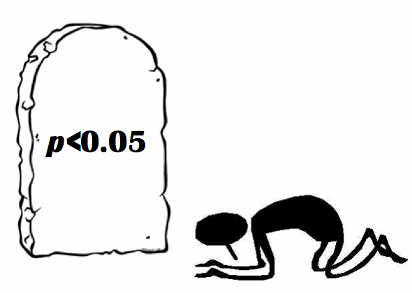
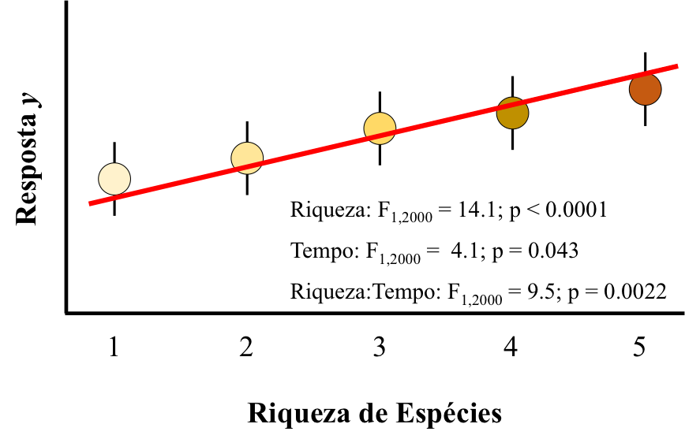
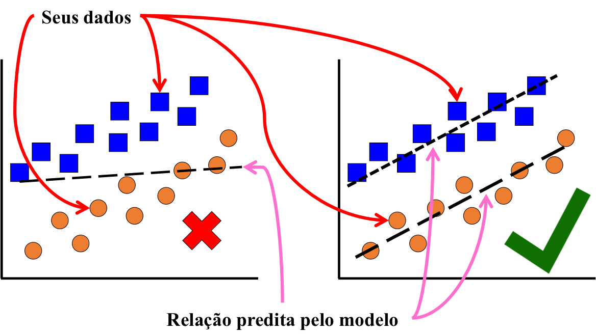

<style type="text/css">
body, td {
   font-size: 18px;
}
code.r{
  font-size: 16px;
}
h1,h2,h3,h4,h5,h6{
  font-size: 24pt;
}
</style>

## Estrutura da Aula

1. [O significado de um modelo estatístico](#anchor1)
2. [Extraindo os parâmetros e predições de um modelo estatístico](#anchor2)
3. [Visualização dos resultados de um modelo estatístico](#anchor3)

## Amamos valores de _p_ e resultados significativos... {#anchor1}

<center>
</img>
</center>

## ...mas olhamos muito pouco para o que esses resultados significam e como eles devem ser apresentados

* Como você interpreta essa figura? Ela está boa ou existe algo de estranho e/ou errado nela?

<center>
</img>
</center>

## Alguns problemas comuns ao apresentar resultados em figuras e tabelas

1. Valores de alguns parâmetros dos testes estatísticos não batem com a forma como o dado é apresentado (_e.g._, medida categórica, graus de liberdade contínuos);
2. Apresentado gráfica do resutlado não bate com a análise de dados (_e.g._, variável preditora é contínua, mas figura o apresentada como uma categoria);
3. Resultados gráficos não consideram efeitos de interações e outras variáveis que descrevem a estrutura do modelo (_e.g._, auto-correlação e não-independência);
4. Métricas descritivas de tabelas e figuras não batem com aquelas vindas dos modelos (_e.g._, cálculo da média simples quando existem efeitos mistos).

## O que queremos mostrar? {.smaller}

* Existem muitos objetivos implícitos ao utilizarmos uma análise estatísticas, mas dois deles que se destacam no contexto desta aula são:
    + Estimar os parâmetros que melhor caracterizem a população e/ou sub-populações estudadas;
    + Desenvolver um modelo que seja capaz de predizer novos valores da variável resposta `y` uma vez que se forneçam novos valores de `x` (x1, x2, x3,...).
* Este último objetivo é particularmente marcante e, inclusive, é um dos critérios de validação de um modelo - ao plotarmos os valores observados _vs_ os valores preditos pelo modelo.

```{r echo=FALSE, warning=FALSE, message=FALSE, fig.align='center', fig.width=4, fig.height=3.5}
library(tidyverse)
modelo1 <- lm(mpg ~ hp, data = mtcars)
par(mar = c(4.5, 4, 1, 1))
plot(mtcars$mpg ~ fitted(modelo1), xlab = "Valores preditos", ylab = "Valores esperados", bg = "firebrick1", pch = 21, cex = 1.5)
abline(a = 0, b = 1)
text(21, 22.5, "1:1", cex = 3, srt = 40)
```

## O que queremos mostrar?

* Sempre que apresentamos graficamente ou em uma tabela os resultados de um modelo, devemos apresentar:
    1. os valores dos parâmetros estimados pelo modelo; e/ou,
    2. de que forma o modelo prediz que `y` e `x` estão relacionados considerando a estrutura geral do modelo (_i.e._outras covariáveis, não-independência, auto-correlação, heterogeneidade nas variãncias, efeitos mistos,...).
* Como interpretar os resultados do modelo abaixo?

```{r warning=FALSE, message=FALSE, results='hide'}
library(tidyverse)
library(readxl)
library(emmeans)
ilhas <- read_excel(path = "../99 - dados para exemplos/ilhas.xlsx", na = "NA")
modelo1 <- lm(log(riqueza) ~ ilha, data = ilhas)
emmeans(object = modelo1, specs = "ilha")
```

## O que queremos mostrar?

```{r}
emmeans(object = modelo1, specs = "ilha")
```

## O que queremos mostrar?

* E o que este resultado do modelo sugere?

```{r}
coef(modelo1)
```

## O que queremos mostrar?

* Existem duas formas de ver a mesma coisa no _output_ de um modelo:
    + A estimativa dos parâmetros que descrevem cada nível de cada variável: ilhas costeiras possuem, em média, `r round(data.frame(summary(emmeans(object = modelo1, specs = "ilha")))[1,2], digits = 2)` espécies, enquanto ilhas oceanicas possuem `r round(data.frame(summary(emmeans(object = modelo1, specs = "ilha")))[2,2], digits = 2)` espécies em média (ambas na escala log).
    + O modelo que prediz o valor da riqueza de espécies em uma ilha, dependendo da sua distância com relação ao continente é: y = $\beta$~0~ + $\beta$~1~ x~1~ = $\beta$~costeira~ + $\beta$~oceanica~ x~oceanica~ = `r round(as.vector(coef(modelo1)[1]), digits = 2)` - `r round(abs(as.vector(coef(modelo1)[2])), digits = 2)` x~oceanica~.
    
## Como interpretar o exemplo abaixo?

```{r}
modelo2 <- lm(log(riqueza) ~ log(area) * ilha, data = ilhas)
coef(modelo2)
```

## Como interpretar o exemplo abaixo? {.smaller}

* log(riqueza) = $\beta$~costeira~ + $\beta$~area~ x~area~ + $\beta$~oceanica~ x~oceanica~ + $\beta$~area:oceanica~ x~area~x~oceanica~
* log(riqueza) = `r round(coef(modelo2)[1], digits = 2)` + `r round(coef(modelo2)[2], digits = 2)` x~area~ - `r abs(round(coef(modelo2)[3], digits = 2))` x~oceanica~ + `r round(coef(modelo2)[4], digits = 2)` x~area~x~oceanica~

```{r}
modelo2 <- lm(log(riqueza) ~ log(area) * ilha, data = ilhas)
coef(modelo2)
```

## Exercício 1

* Com base no modelo abaixo, qual seria o valor predito para a riqueza de espécies de uma ilha oceanica com área de 2680.297 (valor não está na escala log)?
* E qual seria o valor predito para uma ilha costeira de mesma área?
* O que estes dois valores representam?

log(riqueza) = `r round(coef(modelo2)[1], digits = 2)` + `r round(coef(modelo2)[2], digits = 2)` x~area~ - `r abs(round(coef(modelo2)[3], digits = 2))` x~oceanica~ + `r round(coef(modelo2)[4], digits = 2)` x~area~x~oceanica~

## Então, como faríamos para mostrar...

* O valor esperado para a riqueza de espécies para ilhas costeiras e oceanicas, considerando o efeito da área nesta estimativa (conforme sugerido pelo modelo)?

```{r}
emmeans(object = modelo2, specs = "ilha", by = "area")
```

* Note, portanto, que os parametros estimados pelo modelo e o modelo utilizado para determinar a relação entre `y` e `x` (x1, x2, x3,...) caminham lado a lado, e ambos devem ser empregados para demonstrar numericamente e graficamente as relações estudadas.

## Um outro exemplo, através do Exercício 2

* Qual o valor de riqueza de espécies esperado para ilhas costeiras que tenham os seguintes tamanhos abaixo:
* Crie uma figura demonstrando esta relação.

```{r}
data.frame(area = c(66810, 2420, 55850, 40840, 81110, 71020, 81420, 18520, 46440, 54000))
```

## Qual a utilidade de um modelo estatístico, então? {.smaller}

* Um modelo estatístico pode (e deve) ser utilizado para predição, e não só para descrever a relação ou a significância da relação entre duas ou mais variáveis.
    + Predição restrita ao universo amostral que deu origem ao modelo;
    + Dentro deste universo, predição pode ser feita para qualquer novo valor das variáveis preditoras;
* Portanto, o que precisamos demonstrar na forma da tabela são os valores dos parâmetros estimados pelo modelo, e, graficamente, de que forma o modelo que você estabeleceu explica a relação entre as variáveis.

<center>
</img>
</center>

## Extraindo os parâmetros e predições de um modelo estatístico {#anchor2}

* Você tem duas opções principais para extrair as predições de um modelo e, em todas as duas, o ideal é que você consiga colocar estes valores dentro de um `data.frame` ou `tibble`, porque:
    + São classes de objetos que apresentam grande ferramental para a sua manipulação.
    + Facilita a exportação desses resultados para uso posterior (_e.g._, criação de uma figura em um outro script, dados brutos para a criação de uma tabela de resultados).
* Então, o objetivo geral vai ser sempre colocar todo e qualquer resultado que nos interessa em uma daquelas duas classes de objeto e, caso necessário seja armazenar um outro conjunto de resultados ou um conjunto de resultados com estrutura diferente (e.g., número de dimensões), podemos armazenar estes múltiplos `data.frame` ou `tibble` em uma `list` e exportá-la no formato `.rds`.

## Extraindo estimativas de parâmetros de categorias

* Como vimos, podemos utilizar o pacote `emmeans` para realizar diversos tipos de pós-teste para uma análise de dados.
* O objeto resultante das funções deste pacote não são nem um `data.frame` e nem um `tibble`, mas podemos usar a coerção para fazer isso.

```{r}
class(emmeans(object = modelo2, specs = "ilha", by = "area"))
```

## Extraindo estimativas de parâmetros de categorias

```{r}
data.frame(emmeans(object = modelo2, specs = "ilha", by = "area"))
class(data.frame(emmeans(object = modelo2, specs = "ilha", by = "area")))
# vamos armazenar o resultado deste processamento em um objeto para uso posterior
diferencas_ilha <- data.frame(emmeans(object = modelo2, specs = "ilha", by = "area"))
```

## Exerício 3

a. Crie um modelo onde você também incluirá o efeito do tamanho do arquipélago como uma variável preditora, em interação com todas as demais variáveis preditoras do `modelo2`.  
b. Extraia o valor da estimativa dos parâmetros que descrevem a riqueza de espécies em cada um dos tipos de ilha (tamanho x distância), considerando o efeito do tamanho da ilha.  

## Extraindo predições vindas de variáveis contínuas

* Como vimos anteriormente, podemos estimar o valor esperado de uma variável resposta para cada valor de uma variável preditora contínua que tivermos - uma vez que o modelo estatístico tenha sido estabelecido.
* Muitas das funções que ajustam modelos no R possuem uma função companheira que serve para extrairmos as predições do modelo, a função `predict`.
* Essa função tem sempre alguns argumentos importantes, mas que podem variar de um tipo de modelo ao outro:
    + `object`: nome do objeto que comporta o modelo a partir do qual você quer extrair as predições;
    + `se.fit`: um argumento lógico que indica se você quer que os valores do erro associado a cada estimativa sejam apresentados (indisponível quando trabalhamos com modelos mistos);
    + `newdata`: um `data.frame` contendo os valores que você quer usar para gerar novas predições. Este `data.frame` deve conter colunas com as mesmas variáveis preditoras que você usou ao ajustar o modelo - inclusive com os mesmos nomes!
    + `interval`: um vetor com um elemento, que indica se você quer ou não que o intervalo de confiança ou de predição para cada observação também seja retornado pela função.

## Extraindo predições vindas de variáveis contínuas {.smaller}

* No uso mais simples da função `predict` extraimos as predições para cada observação utilizando como _input_ os mesmos valores utilizados para ajustar o modelo - isto é, o próprio `data.frame` que usamos no argumento `data`.

```{r eval=FALSE}
predict(object = modelo2)
```

```{r echo=FALSE}
predict(object = modelo2)[1:70]
```

## Extraindo predições vindas de variáveis contínuas {.smaller}

* No entanto, também podemos fornecer um novo conjunto de dados a partir dos quais novas predições serão geradas.

```{r eval=FALSE}
predizer <- data.frame(area = seq(from = 1, to = 140000, by = 1), ilha = "costeira")
predizer
```

```{r echo=FALSE, warning=FALSE, message=FALSE}
library(tidyverse)
predizer <- data.frame(area = seq(from = 1, to = 140000, by = 1), ilha = "costeira") %>%  tbl_df
predizer
```

## Extraindo predições vindas de variáveis contínuas {.smaller}

* Uma vez que tenhamos criado esta nova tabela, podemos então usar a função `predict` alimentado o argumento `newdata` com ela.

```{r eval=FALSE}
predict(object = modelo2, newdata = predizer)
```

```{r echo=FALSE}
predict(object = modelo2, newdata = predizer)[1:60]
```

## Extraindo predições vindas de variáveis contínuas {.smaller}

* Em todo o caso, o que você precisa fazer para poder ter o `data.frame` com o qual plotar os resultados é unir o resultado do `predict` à tabela que foi usada para dar origem a esses valores.

```{r message=FALSE, warning=FALSE}
library(tidyverse)
cbind.data.frame(predizer, preditos = predict(object = modelo2, newdata = predizer)) %>% 
  tbl_df
```

## O pacote `broom`

* O pacote `broom` oferece algumas funções para tornar a extração dos resultados dos modelos bem atrativa, através de três funções:
    + `augment`: retorna uma tabela com os valores preditos pelo modelo, bem como diversas métricas relativas à influência de cada observação para as estimativas feitas pelo modelo.
    + `glance`: retorna uma tabela com as métricas de ajuste do modelo.
    + `tidy`: retorna a tabela do `summary` do modelo já formata de forma mais elegante.

## O pacote `broom`

```{r warning=FALSE, message=FALSE}
library(broom)
augment(x = modelo2)
```

## O pacote `broom`

```{r}
glance(x = modelo2)
```

## O pacote `broom`

```{r}
tidy(x = modelo2)
```

## Exercício 4

* Extraia as métricas relacionadas ao ajuste dos três modelos que utilizamos até aqui (`glance`; 2 modelos que utilizamos como exemplo e mais o modelo que você trabalhou no exercício anterior) e armazene eles em um único objeto.
* Adicione algum tipo de identificador às informações de cada modelo.
* Exporte este objeto para algum diretório do seu computador, utilizando a extensão `.csv`.

## Visualização dos resultados de um modelo estatístico {#anchor3} {.smaller}

* Como vimos até aqui, podemos gerar os valores preditos por um modelo e adicioná-los a um `data.frame`, com o intuito de utilizar esta informação, por exemplo, para confeccionar uma figura.

```{r warning=FALSE}
ilhas <- mutate(ilhas, log_riqueza_predita = predict(modelo2))
ilhas
```

## Visualização dos resultados de um modelo estatístico

* Com esta informação em mãos, podemos agora proceder para a confecção da figura que descreva de que forma nosso modelo prediz o formato da relação entre as variáveis analisadas.

```{r eval=FALSE,fig.align='center', fig.width=5, fig.height=4}
ggplot(data = ilhas) +
  geom_point(mapping = aes(x = log(area), y = log(riqueza), colour = ilha), size = 3) +
  geom_smooth(mapping = aes(x = log(area), y = log_riqueza_predita, colour = ilha), 
              method = "lm") +
  theme_bw()
```

## Visualização dos resultados de um modelo estatístico {.smaller}

```{r fig.align='center', fig.width=5, fig.height=4}
ggplot(data = ilhas) +
  geom_point(mapping = aes(x = log(area), y = log(riqueza), colour = ilha), size = 3) +
  geom_smooth(mapping = aes(x = log(area), y = log_riqueza_predita, colour = ilha), 
              method = "lm") +
  theme_bw()
```

## Exercício 5

* Crie uma figura que descreva o valor esperado para a riqueza de espécies em ilhas oceânicas e costeiras conforme extraímos e armazenamos no objeto __diferencas_ilhas__.

```{r}
diferencas_ilha
```

## O pacote `visreg`

* O pacote `visreg` é extremamente útil para gerararmos visualizações rápidas do resultado dos modelos estatísticos que estabelecemos.
* A função-base deste pacote é capaz de interagir com praticamente qualquer tipo de modelo que normalmente utilizamos e, portanto, pode nos ajudar bastante a entender o resultado de nossas análises.

```{r}
modelo2
```

## O pacote `visreg`

```{r warning=FALSE, message=FALSE, fig.align='center', fig.width=5, fig.height=4}
library(visreg)
visreg(fit = modelo2, xvar = "ilha")
```

## O pacote `visreg`

```{r warning=FALSE, message=FALSE, fig.align='center', fig.width=5, fig.height=4}
visreg(fit = modelo2, xvar = "area", by = "ilha")
```

## O pacote `visreg` {.smaller}

* O `visreg` interage bastante com o `lattice`, mas tem um argumento que permite que a visualização seja feita nos moldes do `ggplot2`.
* Além disso, ele tem uma série de outros argumentos que permitem outros tipos de manipulação aquilo que será plotado.

```{r warning=FALSE, message=FALSE, fig.align='center', fig.width=5, fig.height=3}
visreg(fit = modelo2, xvar = "area", by = "ilha", gg = TRUE)
```

## O pacote `visreg` {.smaller}

* Podemos também utilizar o resultado da função `visreg` para produzir um `data.frame` de onde vamos utilizar os dados para customizar a figura da maneira como bem entendermos.
* O jeito de fazer isso é passando para o `visreg` um argumento que indique que ele não precisa plotar a figura, e atribuir o resultado dessa função a um objeto.
* Se você conferir, este objeto será uma lista, que contém dois `data.frame` que podemos utilizar: `res` e `fit`.
    + `res`: valores ajustados das observações;
    + `fit`: valores utilizados para a construção da reta de regressão.

```{r eval=FALSE}
exemplo <- visreg(fit = modelo2, xvar = "area", by = "ilha", plot = FALSE)
exemplo$fit
exemplo$res
```

## Algumas palavras de cuidado {.smaller}

* Muitas destas técnicas podem ser usadas para averiguarmos se os resultados de uma análise estatística fazem sentido ou não, e devem ser utilizadas para tal.
* Todas as técnicas apresentadas aqui no intuito de demonstrar como apresentar seus resultados assumem que o modelo que estamos ajustando está correto e, também, que tenhamos desvendado os potenciais viéses e artefatos existentes no conjunto de dados que estamos trabalhando.
* Finalmente, busque sempre apresentar graficamente seus resultados de forma que eles combinem com o modo que você os analisou e com os resultados encontrados, por exemplo:
    + Se existe uma interação entre duas ou mais variáveis, apresente uma figura onde você contemple o resultado da interação;
    + Se você considerou que uma variável preditora é contínua, apresenta os valores de `x` no formato de uma regressão, e não com uma medida de médio e erro associado (o que seria o padrão esperado para uma análise utilizando variáveis categóricas).
